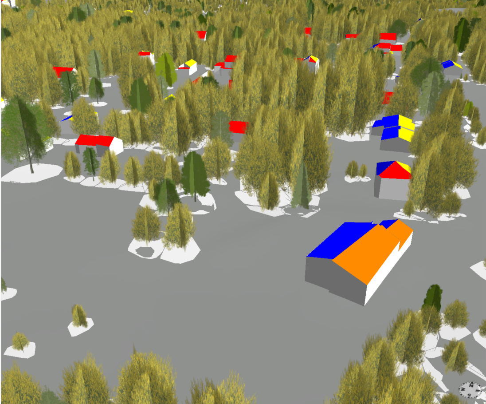

# [CGA](https://doc.arcgis.com/en/cityengine/2024.0/help/help-cga-modeling-overview.htm) rule files for digital twins

As mentioned in the url above : "Computer Generated Architecture (CGA) is a programming language that is used to instruct CityEngine how to automatically generate 3D geometry, and particularly architecture."

The rules shown below were devised to apply to 3D buildings and trees.  Here is an example of applying those rules to data.



## Buildings

This rule file works on  individual surfaces, that is when features are not complete 3D buildings but rather buildings are made up of several surfaces like individual walls, roof sides, etc.  In this case, we're looking at `roof surfaces` and applying colors as a function of how far away from due South the roof surface normal points to.

``` Javascript
version "2024.0"

attr surface_type = ""         
// attr surf_az_float1 = 0.0  
attr surface_rf_azimuth = 0.0   

@StartRule
Surface -->
    case surface_type == "WallSurface":
        color(1,1,1)    // White
    case surface_type == "RoofSurface":
        SolarOrientation
    else:
        NIL

SolarOrientation -->
    // South (180): Red
    case surface_rf_azimuth >= 157.5 && surface_rf_azimuth <= 202.5:
        color(1,0,0)      // Red
    // South-East (135) and South-West (225): Orange
    case surface_rf_azimuth >= 112.5 && surface_rf_azimuth < 157.5:
        color(1,0.5,0)    // Orange
    case surface_rf_azimuth > 202.5 && surface_rf_azimuth <= 247.5:
        color(1,0.5,0)    // Orange
    // East (90) and West (270): Yellow
    case surface_rf_azimuth >= 90 && surface_rf_azimuth <= 112.5:
        color(1,1,0)      // Yellow
    case surface_rf_azimuth >= 247.5 && surface_rf_azimuth <= 270:
        color(1,1,0)      // Yellow
    else:
        color(0,0,1)  // Blue for other orientations
```

## Trees

This rule file determines typical tree types as a function of attributes of individual trees (e.g. a point layer showing tree location or a polygon layer depicting a crown footprint as seen from above)

``` Javascript
version "2017.1"

// Import the plant loader rule
import Plant_Loader:"/ESRI.lib/rules/Plants/Plant_Loader.cga" (Name=Plant_Name, Height=tree_height, Representation="Fan")

// ******************************
// Attributes from your data
// ******************************

@Order(1)
@Group("From Object Attributes",1)
attr tree_height = 10

@Order(2)
@Group("From Object Attributes",1)
attr crown_area = 50

@Order(3)
@Group("From Object Attributes",1)
attr circularity_index = 0.95

@Order(4)
@Group("From Object Attributes",1)
attr aspect_ratio_index = 1.2

// ******************************
// Derived values for scaling
// ******************************

const PI = 3.14159265359
const crown_a = sqrt(crown_area * aspect_ratio_index / PI)    // semi-major axis
const crown_b = sqrt(crown_area / (aspect_ratio_index * PI))  // semi-minor axis

// ******************************
// Plant species selection logic
// ******************************

@Order(5)
@Group("Plant",2)
@Description("Plant name to use in Plant Loader")
attr Plant_Name =
    case circularity_index < 0.9: "Smooth Sumac" // elongated/hedge-like
    else:
        14%: "Balsam Fir"
        14%: "Sugar Maple"
        14%: "Paper Birch"
        14%: "Sassafras"
        14%: "Sweetgum"
        14%: "White Ash"
        else: "White Poplar"

// ******************************
// Main rule
// ******************************

@StartRule
Point -->
    Plant_Loader.Generate
    s(crown_a * 2, tree_height, crown_b * 2) // scale to match crown ellipse and height
```