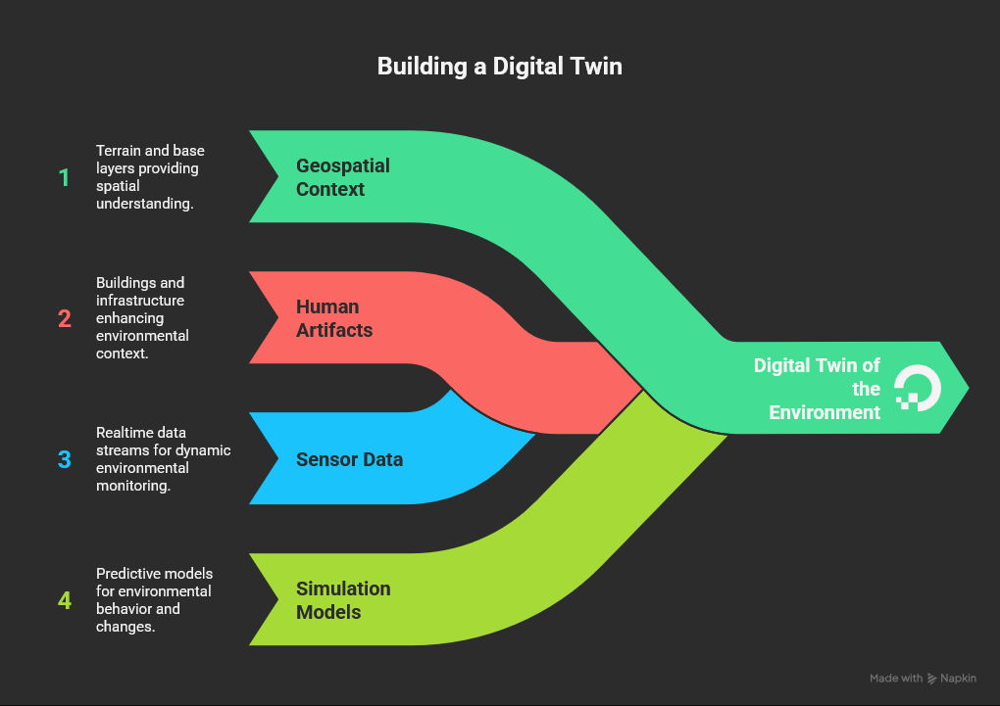
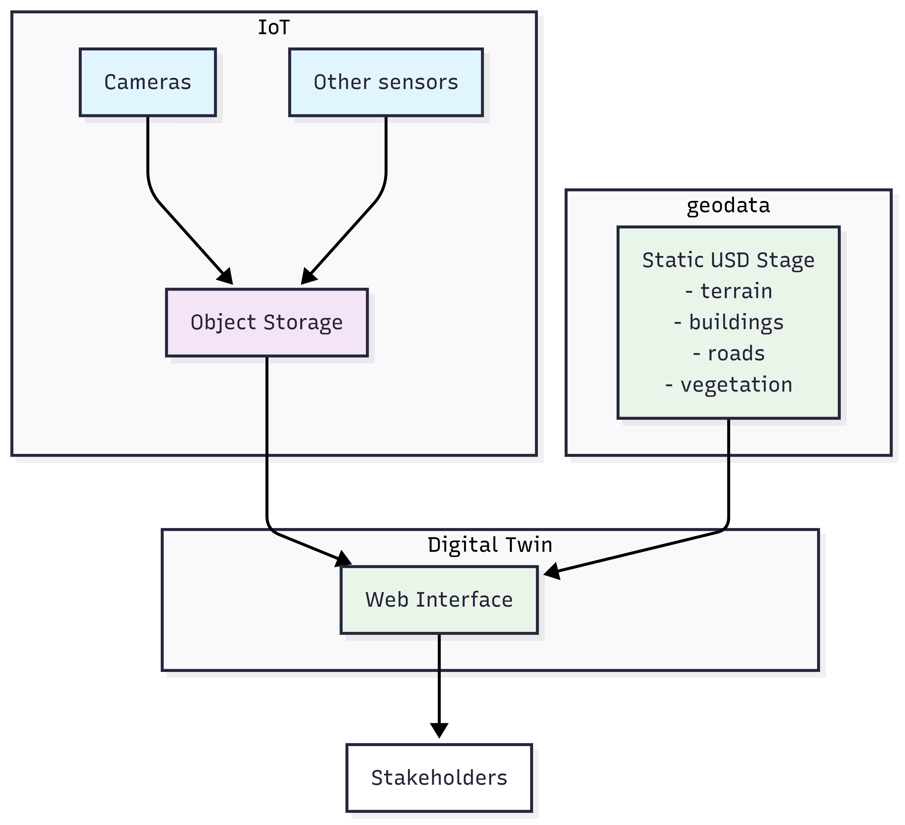
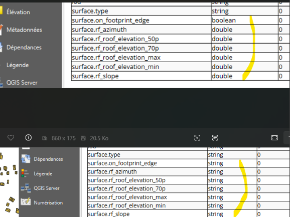

# Digital Twin for a Common Operating Picture

## Objective

Develop a Digital Twin that integrates physical infrastructure (buildings, vegetation, roads, water bodies) with live sensor data (cameras, motion detectors, data loggers) into a USD stage that serves as a **Common Operating Picture** for stakeholders.



## Scope

**Physical Infrastructure:**
- 3D buildings and terrain
- Vegetation and road networks  
- Water bodies and utilities

**Sensor Integration:**
- Camera feeds and imagery
- Motion detection systems
- Environmental data loggers
- GPS tracking devices

**Target Platform:**
- OpenUSD format for interoperability
- Nvidia Omniverse for visualization and collaboration
- Real-time sensor data integration
- Web-based stakeholder access

## Technology Stack

**Core Components:**
- **Data Storage**: DeltaLake tables on object storage (S3/MinIO)
- **Data Processing**: Polars (Rust-backed DataFrames)
- **Object Storage**: obstore (high-performance S3 access)
- **3D Platform**: Nvidia Omniverse + USD
- **Environment**: Pixi for dependency management

**Development & Testing:**
- **Notebooks**: Jupyter for interactive testing (one-off tests and end-to-end scenarios)
- **MQTT Testing**: Interactive sensor simulation and data flow validation
- **DeltaLake Testing**: Data pipeline verification and performance testing

**Infrastructure & Deployment:**
- **Kubernetes Platform**: Rancher Desktop for container orchestration
- **Omniverse Nucleus**: Deployed in K8S for collaboration and USD storage
- **Web Applications**: Browser-based interfaces for stakeholder interaction
- **Omniverse Streaming**: Web-based 3D visualization for non-desktop users

**Data Flow:**
```
Sensors → DeltaLake → Object Events → Omniverse → USD Updates → Web Interface
```

Schematically



## Current Status

**Phase 1**: Infrastructure setup and sensor data ingestion architecture
- ✅ Evaluate direct sensor writes to DeltaLake
- ✅ Test object storage integration
- 🔄 Establish Omniverse connection patterns
- ✅ **Base USD Scene**: CityEngine export completed (12-hour export time acceptable for one-time base scene)
- ❌ **Software Setup**: Cannot currently visualize the USD export - need proper viewing tools

**Infrastructure Challenges:**
- **USD Visualization**: Need software setup to view and validate the exported USD scene
- **K8S Deployment**: Need to deploy Omniverse Nucleus and supporting services in Rancher
- **Stakeholder Access**: Require web-based interfaces for non-technical users

## Tasks

### **Immediate Priority**
- [ ] **Set up USD viewing tools** - Install and configure software to visualize the exported CityEngine USD scene
- [ ] **Validate base USD scene** - Review exported buildings, trees, roads for quality and accuracy
- [ ] **Test MinIO sensor credentials** - Verify sensor can write to collab-ym bucket with proper authentication (notebook testing)

### **Infrastructure Deployment**  
- [ ] **Deploy Omniverse Nucleus in Rancher** - Set up K8S deployment for collaborative USD storage
- [ ] **Configure Omniverse streaming** - Enable web-based 3D visualization for stakeholders
- [ ] **Set up web applications** - Create browser interfaces for non-technical user access
- [ ] **Test K8S deployment** - Verify Nucleus accessibility and performance in Rancher environment

### **Sensor Data Pipeline**
- [ ] **Implement sensor → DeltaLake writer** - Create minimal code using obstore + delta-rs (notebook prototyping)
- [ ] **Set up object storage events** - Configure MinIO/S3 events to trigger USD updates
- [ ] **Create Omniverse extension** - Develop Kit SDK extension to read DeltaLake and update USD
- [ ] **Test sensor data integration** - Validate GPS/camera data appears in USD scene (notebook testing)

### **End-to-End Testing**
- [ ] **Deploy test sensors** - Set up simulated camera and GPS data sources (notebook simulation)
- [ ] **Validate data flow** - Test complete pipeline: sensor → DeltaLake → Omniverse → web interface (notebook end-to-end testing)
- [ ] **Stakeholder demo** - Demonstrate Common Operating Picture with live sensor updates
- [ ] **Performance optimization** - Tune system for operational latency and throughput requirements

## Miscellaneous

**Supporting Initiatives:** Side projects and contributions that enable or improve the main digital twin objective.

### **CityJSON QGIS Plugin Data Type Fix**
- **Issue**: [cityjson-qgis-plugin#68](https://github.com/cityjson/cityjson-qgis-plugin/issues/68) - Plugin imported all attributes as strings, breaking numeric CGA rules
- **Impact**: Prevented use of CGA rules for tree crown area calculations and other numeric comparisons in building/vegetation processing
- **Solution**: Implemented `SemanticSurfaceFieldsDecorator` class to preserve original data types (int, float, bool) during import.

Here is an example of 'after' and 'before'

- **Status**: ✅ Fixed - numeric attributes now properly typed, enabling CGA rules for procedural generation
- **Relevance**: Essential for CityEngine workflows that generate the base USD scene with buildings and vegetation 